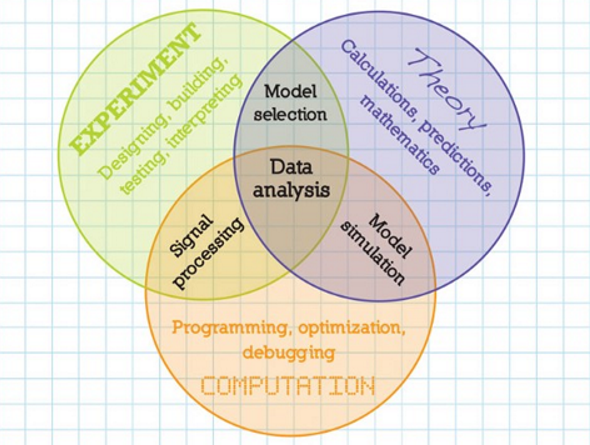

# 认识分子模拟
## 在学科知识体系的位置
>化学→理论化学→计算化学  

**计算化学**：是理论化学的一个分支，主要目的是利用有效的数学近似以及电脑程序计算分子的性质，表示计算技术在化学中的应用，范围从分子的量子力学到大型复杂分子聚集体的动力学。  
计算化学研究的主要内容包括：
- 原子和分子的计算机表述
- 利用计算机协助存储和搜索化学信息数据 （参见化学数据库）
- 研究化学结构与性质之间的关系 （参见[定量构效关系](https://baike.baidu.com/item/定量构效关系/0?fromModule=lemma_inlink)(QSAR)及定量构性关系(QSPR)）
- 根据对作用力模拟对化学结构进行理论阐释
- 计算机辅助化合物合成
- 计算机辅助特性分子设计（例如[计算机辅助药物设计](https://baike.baidu.com/item/计算机辅助药物设计/0?fromModule=lemma_inlink)）

**分子模拟**：molecular simulation（MS），molecular modeling（MM），是使用计算机以原子水平的分子模型来模拟分子的结构和行为，从而获得模型的物理和化学性质。模拟可以基于量子力学、分子力学/牛顿力学等。  
分子模拟得主要分类：
- 量子力学
	- 量子化学
	- 第一性原理、从头计算
- 经典力学
	- 分子力学（力场方法）(molecular mechanics, MM)
	- Monte Carlo(MC)模拟
	- 分子动力学模拟(molecular dynamics, MD)
	- 粗粒化模拟

## 辨析
**分子动力学模拟 & 第一性原理 & 量子化学计算**
- **分子动力学模拟**是基于牛顿力学研究分子体系的一种分子模拟方法。而第一性原理是基于量子力学研究周期性体系（比如晶体、界面等）的一类计算方法。
- **第一性原理**（ab initio）计算主要参照密度泛函理论（DFT），即将电子看作是在原子核周围运动的独立粒子，并通过构建电子密度函数来描述电子在给定状态下的能量和动量。也称为全始算、从头算。常指基于量子力学理论的，完全由理论推导而得，不做任何的假设和任何经验值的带入，所以是较为精密的计算方法，由于不使用基本物理常数和原子量以外的实验数据、以及经验或者半经验参数的求解薛定谔方程的方法。大多数情况下这些第一原理方法包括一定的近似，而这些近似常由基本数学推导产生，例如换用更简单的函数形式或采用近似的积分方法。
- **量子化学**则是基于量子力学研究**独立的化学体系**（单个分子、独立团簇）的性质（构型、键能、尺寸、静电势等），目前**量子化学计算**也大量参照DFT理论。
- **第一性原理** & **量子化学**都基于量子力学，但精度和适用的范围不同：第一性原理计算是指通过理论推导和数值求解薛定谔方程，获得原子的电子结构和晶体的物理化学性质等信息的计算方法，固体、材料、表面等物理领域。量子化学计算则是使用量子化学方法研究分子体系的性质和反应过程，它包括电子结构计算、分子轨道计算、能量计算等，化学反应和官能团活性等化学领域。*第一性原理侧重于解决物理方面的问题，而量子化学则将注意力集中到化学反应，官能团活性等等。*
- 当用量子力学处理电子的时候就是第一原理方法，密度泛函是一种、半经验也是、HF也是，等等。当忽略电子的细节的时候，就直接用势函数描述电子的效果，就是分子力学的方法。
- **MD模拟是基于势能的**，而势能可以简单地看作两体势、三体势、四体势、范德华作用及静电作用等。==这些参数除了可以通过实验获得，还可以从量子力学的角度出发采用第一性原理计算获得。==将量子力学和分子动力学模拟结合（2013年诺贝尔化学奖），用以分析原子尺度上更宏伟为和更复杂的物理过程，已逐步发展成一门新的学科，即量子力学分子动力学模拟。 

## 意义

## 工作流程
>建模-->设参-->运行-->分析

